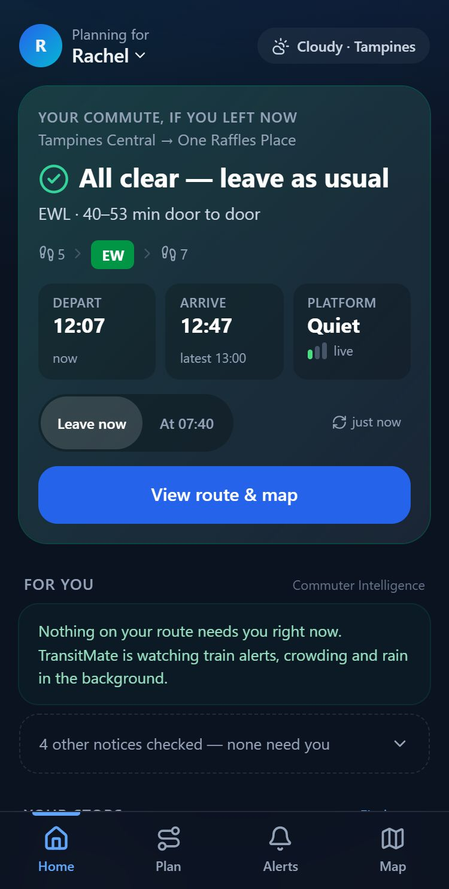
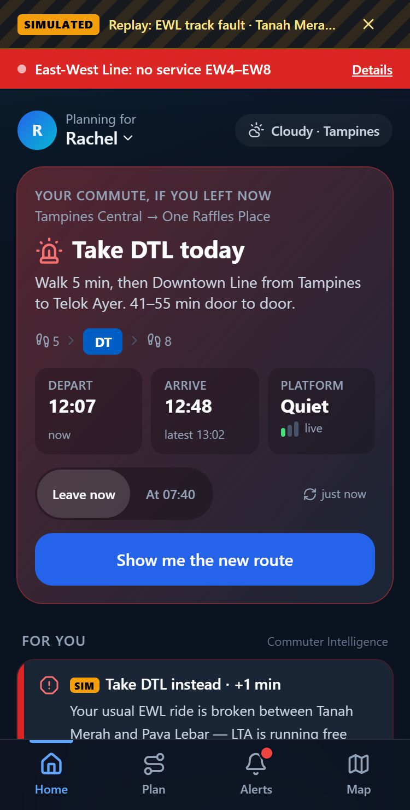
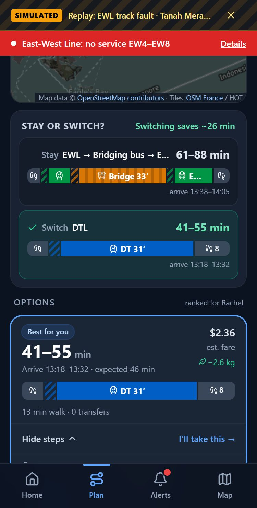
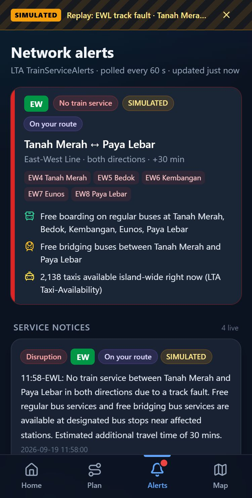

# TransitMate

**A commuter companion that tells you *before you leave* when today is different, and what to do instead.**

NEBULA X 2026 · Problem Statement 2 — Smart Commuter Companion · built for **Rachel** (Tampines → Raffles Place, EWL, leaves 07:40, desk by 08:45).

```
              ＿＿
　　 　　　🌸＞　　フ      "Take the DTL from Tampines today, +1 min.
　　　 　　| 　_　 _l       Your usual EWL ride is broken between
　  　  　／` ミ＿xノ        Tanah Merah and Paya Lebar."
　　 　 /　　　 　 |
　　　 /　 ヽ　　 ﾉ       — TransitMate, one line, before she leaves
　 　 │　　|　|　|
　／￣|　　 |　|　|
　| (￣ヽ＿_ヽ_)__)
　＼二つ
```

| Normal day: all clear | EWL fault (replay): one-line action | Why it changed: usual vs new route | Alerts: live feed + labelled replay |
|---|---|---|---|
|  |  |  |  |

- **Demo walkthrough:** [`docs/demo.gif`](docs/demo.gif), a phone-sized capture of the journey below.
- **Write-up** (persona, architecture, assumptions, limitations, how every number was measured): [`WRITEUP.md`](WRITEUP.md)

---

## What it does

- **Proactive commute verdict.** The Home screen re-plans Rachel's saved commute every 60 s against live conditions. It shows one of three states: **All clear**, **Heads-up**, or **Take X today**. She only gets the red card when her trip gets worse by more than her own threshold (10 min by default).
- **Door-to-door route planning that reacts to the network.** It combines rail, bus and walking, and each option carries a **time range**, not a single number. Walking legs are routed on OpenStreetMap footpaths, and bus waits come from live LTA arrivals. When conditions change, the plan changes and **says why**.
- **Visual trade-off.** The map shows the recommended route, your usual route (dashed), and the disrupted stretch (red). Every option shows expected arrival, fare estimate, crowding at boarding, live bus load and CO₂ saved.
- **Planned and unplanned events.**
  - Unplanned: live `TrainServiceAlerts` affected segments block or slow those rail edges. LTA's own mitigation (free public bus stations and bridging buses) is read from the feed and routed on.
  - Planned: the notice stream (e.g. today's real *"Bukit Panjang LRT closed on 20 Sep"*) is classified and checked against your route.
- **Crowding, rain and lifts.** The engine also uses:
  - Station Crowd Density (real-time and 30-min forecast)
  - bus `Load`
  - the NEA 2-hour nowcast
  - lift outages (`v2/FacilitiesMaintenance`) for the step-free persona
- **Underground / no signal.** An offline app shell (service worker) plus the last journey and alerts in local storage. The UI marks cached data with its age.

---

## Prerequisites

| Need | Version | Notes |
|---|---|---|
| Node.js | **20 or newer** (tested on 25.6) | https://nodejs.org |
| pnpm | 9+ (repo pins 11.9 via `packageManager`) | `corepack enable` installs the pinned version automatically |
| LTA DataMall AccountKey | free | Register at https://datamall.lta.gov.sg/content/datamall/en/request-for-api.html. The key arrives by email within minutes. |

No database, no Docker, no paid services. data.gov.sg, OneMap search, the OSM foot router and the OSM tiles need no key.

## Install and run (copy-paste)

```bash
git clone https://github.com/MilkmanAbi/TransitMateProject.git
cd TransitMateProject
corepack enable                 # uses the pnpm version pinned in package.json
pnpm install
cp .env.example .env            # then put your key in .env:  DATAMALL_KEY=xxxxxxxx
pnpm start                      # builds the React app, then serves API + app on http://localhost:3001
```

On first start the server downloads LTA's bus network once (`BusStops`, `BusRoutes`, `BusServices`, ~70 paged calls, about 5–20 s). It caches the result in `server/.cache/` for 24 h. `GET /api/health` shows `"network": true` when ready.

**Open it on a phone.** Put the phone on the same Wi-Fi and open `http://<your-laptop-LAN-IP>:3001`. Mobile browsers only allow "Current location" over HTTPS, so on plain LAN http use the Home/Work chips or type a place. For a public HTTPS URL, run `npx localtunnel --port 3001` (or `cloudflared tunnel --url http://localhost:3001`).

**Development mode** (hot reload): `pnpm dev`. The API runs on :3001 and Vite on http://localhost:5173, proxying `/api`.

### Configuration

| Variable | Required | Meaning |
|---|---|---|
| `DATAMALL_KEY` | yes | LTA DataMall AccountKey (`LTA_ACCOUNT_KEY` is also accepted, as in BusTech) |
| `PORT` | no | Server port, default `3001` |

---

## What to click: the demo journey (Rachel, EWL fault)

1. **Home.** You're planning for **Rachel**. The hero card plans her Tampines → One Raffles Place commute on **live** data: bus arrivals, station crowding, weather, alerts. On a normal day it says **All clear — leave as usual** and shows EWL, the time range, arrival time and platform crowding.
2. **Alerts** tab → *Demo: replay a disruption* → **EWL track fault · Tanah Merah ↔ Paya Lebar**. This injects a `TrainServiceAlerts` record in the official shape, with `Status 2`, `AffectedSegments`, `FreePublicBus` and `FreeMRTShuttle`. It is labelled **SIMULATED** everywhere it appears, because the live feed has no affected segments on a normal day (PS2 §2.6). Everything else stays live.
3. **Home** turns red: **Take DTL today**, with the reason in one line and the first instruction ("Walk 5 min, then Downtown Line from Tampines to Telok Ayer").
4. Tap **Show me the new route**. The map draws the usual EWL route dashed with the cut segment in red, next to the recommended route. The *Route changed — here's why* panel explains the change. Each option shows a time range, live bus ETA and load, and crowding.
5. Back in **Alerts**, switch to **EWL signalling fault (+20 min delays)**. It is now a *delay*, not a cut, and the engine compares it against Rachel's 10-min threshold. Open the persona switcher (*Planning for Rachel ▾*) to try a 5-min or 20-min threshold and see when it stops interrupting.
6. **Map** tab: every MRT/LRT station is coloured by **live** LTA crowd level. Search a stop (e.g. `Raffles Pl`, `75009`) or zoom in and tap a green stop for live arrivals.
7. Stop the simulation with the ✕ on the amber banner.

---

## API (Express proxy, `server/`)

DataMall needs a private `AccountKey` and sends no CORS headers, so every DataMall call goes through the server, with a TTL cache in memory. The key never reaches the browser.

| Endpoint | Source | Cache |
|---|---|---|
| `GET /api/bus/arrivals?stop=75009` | `v3/BusArrival` | 20 s |
| `GET /api/bus/stops?skip=0` · `/stops/search?q=` · `/stops/near?lat=&lng=` | `BusStops` | 1 h / in-memory index |
| `GET /api/bus/services` · `/api/bus/routes?service=10&dir=1` | `BusServices`, `BusRoutes` | 1 h |
| `GET /api/train/alerts[?scenario=ewl-track-fault]` | `TrainServiceAlerts` (+ labelled replay) | 30 s |
| `GET /api/train/crowding?line=EWL[&station=EW2]` · `/crowding/now` | `PCDForecast`, `PCDRealTime` | 30 min / 5 min |
| `GET /api/train/lifts` | `v2/FacilitiesMaintenance` | 10 min |
| `GET /api/taxi?lat=&lng=` | `Taxi-Availability` (returns a count) | 30 s |
| `GET /api/weather?lat=&lng=` | data.gov.sg 2-hour nowcast | 5 min |
| `GET /api/geo/search?q=` | OneMap search + OSM station names | 1 h |
| `GET /api/plan?from=lat,lng,name&to=lat,lng,name&profile=rachel[&depart=ms][&scenario=]` | Journey planner | — |
| `GET /api/lta?path=v3/BusArrival&BusStopCode=75009` | BusTech-compatible passthrough (allow-listed) | 15 s |

## Project layout

```
client/            React 18 + Vite + Tailwind PWA (mobile-first)
  src/lib/cie.ts     Commuter Intelligence Engine (rules)
  src/pages/         Home · JourneyPage · AlertsPage · MapPage · StopPage
server/            Express proxy + planner (TypeScript, run with tsx)
  src/lib/planner.ts   rail Dijkstra + bus/bus↔rail search, live enrichment, usual-vs-live
  src/lib/alerts.ts    TrainServiceAlerts parser, canonical lines, replay scenarios
  src/data/mrt.json    rail graph built from OpenStreetMap (scripts/build-mrt.py)
fixtures/          raw live captures from 19 Sep 2026 (TrainServiceAlerts, FacilitiesMaintenance)
scripts/           build-mrt.py (OSM → rail graph), shot.mjs (phone screenshots in Chrome)
```

## Data and licences

- **LTA DataMall**: bus arrivals, stops, routes, services, TrainServiceAlerts, PCDRealTime/PCDForecast, FacilitiesMaintenance, Taxi-Availability. Used under the LTA DataMall terms.
- **OpenStreetMap**: rail station points and codes (Overpass extract, `scripts/osm-stations-raw.json`), footpath routing (FOSSGIS OSRM `routed-foot`), basemap tiles (OSM France / HOT). **© OpenStreetMap contributors, ODbL.** Attribution is shown on every map.
- **data.gov.sg / NEA**: 2-hour weather nowcast (Singapore Open Data Licence).
- **OneMap (SLA)**: place search.
- **NebulaX dataset**: `AmendmenttoMP2014RailStation.geojson` station footprints, drawn on the Map tab when zoomed in.

No credentials are committed. `.env` is git-ignored and `.env.example` lists the variable names only.
